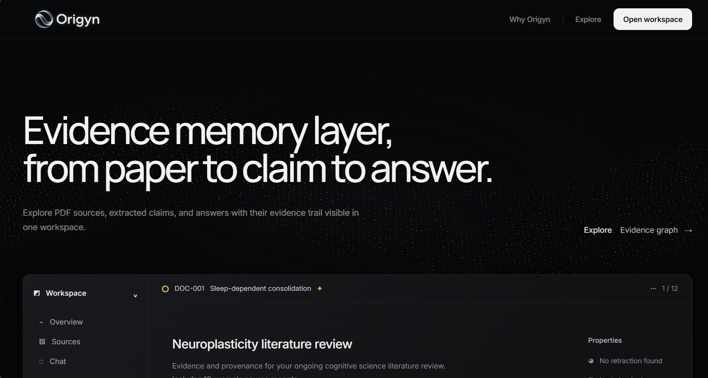
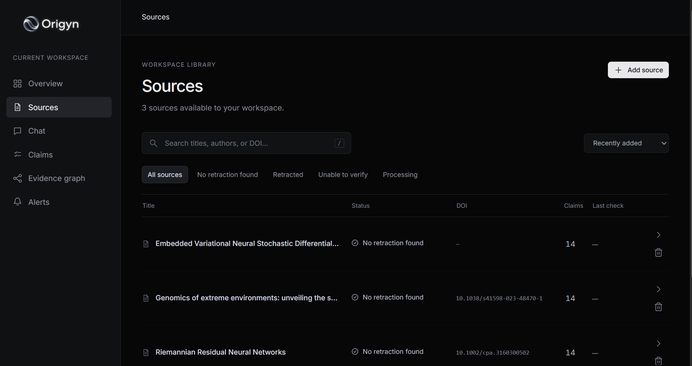
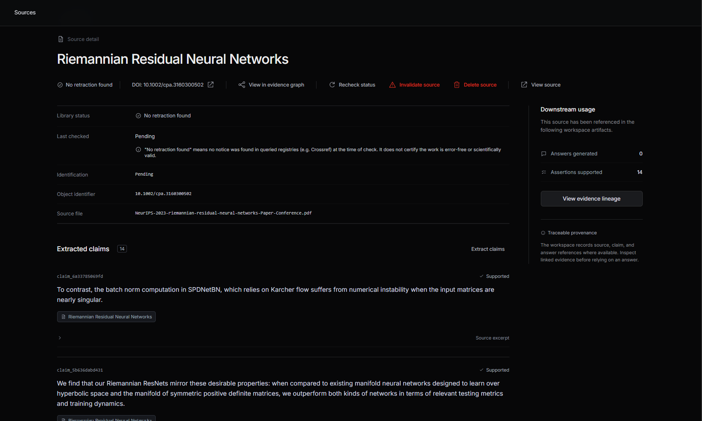
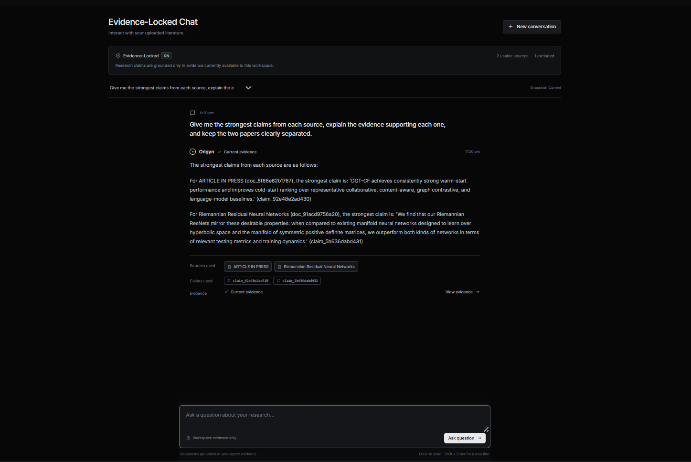
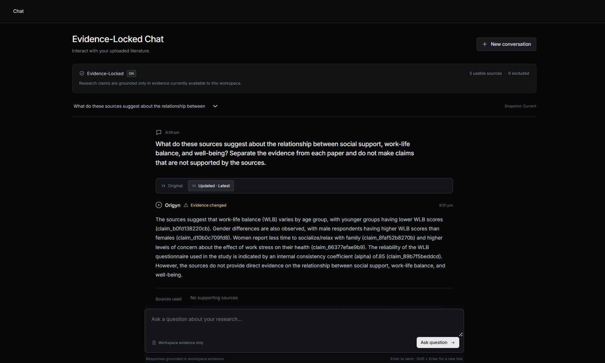
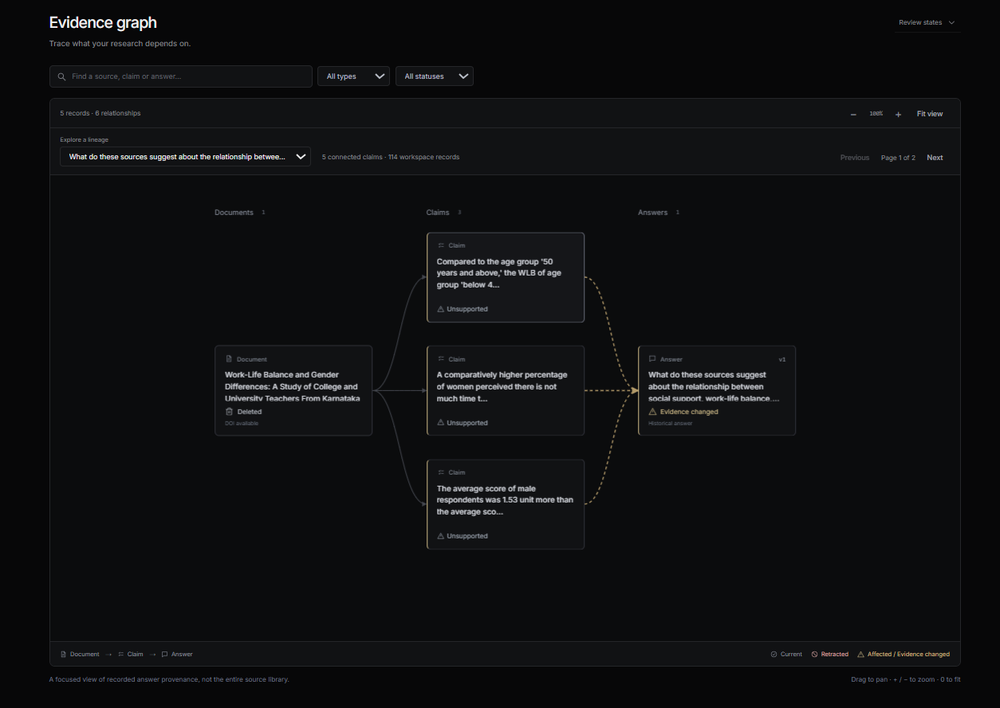
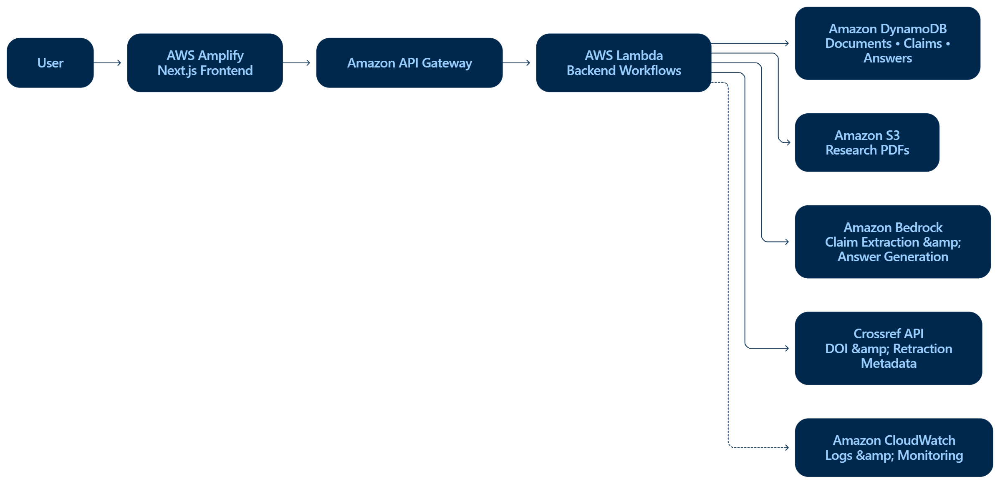

<div align="center">
  

# Origyn

**Evidence memory for AI-assisted research.**

From paper to claim to answer — with the provenance intact.

[](https://nextjs.org)
[](https://www.typescriptlang.org)
[](https://aws.amazon.com/lambda)
[](https://aws.amazon.com/bedrock)
[](https://aws.amazon.com/amplify)

## Project links

- **Live Demo:** [Open Origyn](https://main.dp329woyjanli.amplifyapp.com/) — no signup required
- **Demo Video:** [Watch on YouTube](https://youtu.be/N-cvKtMDTh0)
- **AWS Builder Center Blog — Parth Malhotra:** [Read the article](https://builder.aws.com/content/3Jasyte35BEeMNg7OslJq1wjvR7/the-paper-got-retracted-our-ai-answer-didnt-get-the-memo-building-origyn-on-aws)
- **AWS Builder Center Blog — Abdul Farooqui:** [Read the article](https://builder.aws.com/content/3JanazHhI0rn6OotgEoYlBqtd4b/the-paper-got-retracted-our-ai-answer-didnt-get-the-memo-building-origyn-on-aws)

</div>

---

## The problem: AI answers can outlive their evidence

Here is a scenario that happens in real research workflows.

A researcher asks an AI assistant a question about a topic they are studying. The tool pulls from several papers, produces a well-structured answer, and the researcher moves on. Three months later, one of those source papers is retracted. The AI answer still looks perfectly fine. It still cites the same papers. Nothing visually changed.

The answer has not been updated. The evidence underneath it has.

This is not a hypothetical edge case. Published research shows that retracted work continues to be cited routinely:

- A 2022 study examined 7,813 retracted papers and 169,434 citations. Among 13,252 citations that occurred *after* retraction, only approximately **5.4% acknowledged the retraction**.¹
- In a separate study of retracted systematic reviews, **60.8% of identified post-retraction citations occurred after the retraction date**.²

LLMs introduce a related pressure: a 2023 Nature study found that in its experimental setup, **55% of GPT-3.5 citations and 18% of GPT-4 citations were fabricated** — references that look plausible but do not exist.³ (These figures apply to that study's specific conditions, not universally.)

Tools like [Crossref](https://www.crossref.org) expose scholarly metadata and retraction information via API. That part exists. What we found less addressed is the question that follows: **once evidence changes, what happens to the AI answers that already used it?**

Detecting that a paper was retracted is step one. Origyn asks what happens to the claims and generated answers that depend on it.

---

## Why we built it

We considered a lot of directions early on: AI agents, document summarizers, PDF chatbots, workflow automation. Most ideas felt like variations of tools that already existed or were being built by several teams simultaneously.

The question shifted from "what else can we make an LLM do?" to "what goes wrong around LLMs that still feels unresolved?"

That led to provenance, evidence drift, retracted research, stale answers — and eventually, Origyn.

The core observation is simple: most research AI remembers the conversation. Origyn tries to remember the *evidence behind the answer*.

---

## What Origyn does

Most research AI tools follow a linear path:

```
Document → Retrieval → Answer
```

Origyn adds a layer:

```
Document → Claim → Answer
```

And maintains the connections after the answer is generated.

### The workflow

1. **Upload a PDF source** — the system extracts text and attempts to identify the paper
2. **Crossref check** — a DOI is detected (if present) and checked against Crossref for retraction metadata
3. **Status assigned** — the document receives a status based on what was found
4. **Claim extraction** — Amazon Bedrock extracts key factual claims from the source
5. **Evidence-grounded answer** — when you ask a question, Bedrock generates an answer using only *usable* evidence (claims from non-retracted, non-invalidated sources)
6. **Provenance recorded** — the answer stores exactly which claims and documents it used
7. **Evidence changes** — if a source is retracted, invalidated, or deleted, dependent claims and answers are updated
8. **Impact propagates** — affected answers are marked `EVIDENCE_CHANGED`; regeneration is offered using remaining usable evidence

### Statuses

**Document:**

| Status | Meaning |
|--------|---------|
| `PROCESSING` | Upload received, pipeline running |
| `ACTIVE` | No retraction found in Crossref — usable as evidence |
| `RETRACTED` | Retraction detected via Crossref or manually flagged |
| `UNKNOWN` | Paper could not be identified with confidence |
| `INVALID` | Manually invalidated |
| `DELETED` | Removed from the active library |

> **Important:** `ACTIVE / No retraction found` does not mean the paper is scientifically valid. It means Crossref returned no retraction record for the DOI.

**Claim:**

| Status | Meaning |
|--------|---------|
| `SUPPORTED` | Source document is usable |
| `UNSUPPORTED` | Source has been retracted, invalidated, or deleted |

**Answer:**

| Status | Meaning |
|--------|---------|
| `CURRENT` | Evidence still intact |
| `EVIDENCE_CHANGED` | One or more source claims became unsupported after generation |

If regeneration is triggered but no usable evidence remains: **`NO_USABLE_EVIDENCE`**.

---

## A concrete example

```
Paper A  →  Claim A  ┐
                     ├→  Answer V1  (CURRENT)
Paper B  →  Claim B  ┘
```

Paper B is retracted.

```
Paper B   →  RETRACTED
Claim B   →  UNSUPPORTED
Answer V1 →  EVIDENCE_CHANGED
```

Regeneration runs using remaining usable evidence (Claim A only):

```
Answer V2  (CURRENT, previousAnswerId = V1)
```

If Paper A is also removed before regeneration:

```
NO_USABLE_EVIDENCE
```

Answer V1 is preserved in history. It is not deleted; it just reflects that its evidence changed.

---

## Feature highlights

| Feature | Why it matters |
|---------|---------------|
| Evidence-aware chat | Answers are generated only from usable claims — not from all documents indiscriminately |
| Claim extraction | Bedrock extracts discrete factual claims per source, not just semantic chunks |
| Evidence Graph | Visual Document → Claim → Answer lineage, inspectable at any time |
| Crossref / retraction checks | DOI-based metadata lookup on upload and on-demand recheck |
| Answer version lineage | Each regeneration records what changed and why, with links to prior versions |
| Evidence-change propagation | One source change cascades to claims and answers automatically |
| Provenance-aware deletion | Removing a source preserves the history it contributed to |
| View original source | Presigned S3 URLs give time-limited access to the uploaded PDF |
| `NO_USABLE_EVIDENCE` state | System can explicitly abstain rather than fabricate an answer |

<div align="center">
  
  <br/><br/>
  
  <br/><br/>
  
  <br/><br/>
  
</div>

---

## Evidence Graph

<div align="center">
  
</div>

The graph makes the full lineage inspectable. Every node — document, claim, answer — is visible, and the edges show how evidence flows. Clicking a node navigates to the relevant detail view. The graph supports zoom, pan, and focused navigation.

The practical use case: if an answer is marked `EVIDENCE_CHANGED`, you can open the graph, see which document changed, and trace exactly which claims and answers were affected.

---

## How AWS powers Origyn

Origyn is built for the **WeMakeDevs × AWS First Commit** hackathon, **Ship It** track.

AWS is not just hosting here — it is the entire application infrastructure.

```
Browser / Next.js (AWS Amplify Hosting)
         ↓
Amazon API Gateway (HTTP API)
         ↓
AWS Lambda (15 serverless handlers)
    ├── Amazon DynamoDB  (documents, claims, answers, lineage)
    ├── Amazon S3        (PDF storage, presigned URL delivery)
    ├── Amazon Bedrock   (claim extraction, evidence-grounded generation)
    └── Crossref REST API (retraction / scholarly metadata)

Observability: AWS CloudWatch
```

<div align="center">
  
</div>

### AWS Lambda

Every backend operation runs as a Lambda function. There are 15 handlers:

| Handler | Purpose |
|---------|---------|
| `uploadDocument` | Receive PDF, store to S3, parse text, identify paper, call Crossref, extract claims via Bedrock |
| `getDocuments` | List documents with current status |
| `getDocument` | Full document detail including claims and impact |
| `deleteDocument` | Soft-delete with tombstone preservation |
| `extractClaims` | Run or return cached Bedrock claim extraction |
| `recheckDocument` | Re-query Crossref and propagate any status change |
| `invalidateDocument` | Manual invalidation with impact propagation |
| `getDocumentImpact` | Return counts of affected claims and answers |
| `getDocumentUrl` | Generate a presigned S3 URL for PDF viewing |
| `chat` | Evidence-locked question answering via Bedrock |
| `getAnswers` | List all answers with current status |
| `getAnswer` | Single answer with provenance metadata |
| `regenerateAnswer` | Re-run generation using remaining usable claims |
| `getGraph` | Build full Document → Claim → Answer graph |
| `health` | Simple health check |

### Amazon API Gateway

HTTP API gateway between the Next.js frontend and Lambda. All frontend calls go through a single base URL. No backend URLs are hard-coded in the React components — the frontend uses an abstraction layer (`frontend/lib/api.ts`) that routes to the correct environment.

### Amazon DynamoDB

Three tables store the core data model:

- **Documents table** — document records, DOI, status, retraction metadata, S3 key
- **Claims table** — extracted claims with status and source document references
- **Answers table** — generated answers with full claim/document provenance, version lineage, and status

DynamoDB fit well here because the data model evolved frequently during development, and the evidence state/lineage relationships do not map cleanly to relational tables.

### Amazon S3

PDFs uploaded by users are stored in a private S3 bucket. When a user wants to view a source document, the backend generates a presigned URL with a short expiry — the PDF is never exposed directly via a public path.

### Amazon Bedrock

Origyn uses Amazon Bedrock as its managed generative AI layer.

- `BEDROCK_CLAIM_MODEL_ID` configures the Amazon Nova model used for extracting structured claims from research papers.
- `BEDROCK_REASONING_MODEL_ID` configures the Amazon Nova model used for evidence-grounded reasoning and answer generation.

Keeping these models configurable allows claim extraction and reasoning to evolve independently without changing the rest of the application architecture.

### Amazon CloudWatch

Lambda logs ship to CloudWatch automatically. During development this made the difference between "got a 500" and "got a 500 because the handler path in the deployment zip was wrong". Structured error logging in the handlers made failures diagnosable without SSH access to anything.

### AWS Amplify Hosting

The Next.js frontend is deployed via Amplify, connected to the `main` branch of this repository. Push to `main` → Amplify builds and deploys automatically using `amplify.yml`.

Live: **https://main.dp329woyjanli.amplifyapp.com**

---

## Tech stack

| Layer | Technology |
|-------|-----------|
| Frontend framework | Next.js 14 (App Router) |
| UI language | TypeScript / React 18 |
| 3D background | Three.js + React Three Fiber |
| Backend runtime | Node.js on AWS Lambda |
| Backend language | TypeScript (compiled to JS for deployment) |
| API layer | Amazon API Gateway (HTTP API) |
| AI / Reasoning | Amazon Bedrock — Amazon Nova models for claim extraction and evidence-grounded answer generation |
| Database | Amazon DynamoDB |
| File storage | Amazon S3 |
| Scholarly metadata | Crossref REST API |
| Observability | AWS CloudWatch |
| Frontend hosting | AWS Amplify |
| PDF parsing | pdf-parse |

---

## What happens when evidence changes

1. A source document is retracted, manually invalidated, or deleted
2. All claims derived from that document become `UNSUPPORTED`
3. Any answer that used those claims is marked `EVIDENCE_CHANGED`
4. The historical answer is preserved — it is not deleted or silently rewritten
5. The user can request regeneration
6. If remaining usable claims exist → new answer version generated; `previousAnswerId` links back
7. If no usable evidence remains → `NO_USABLE_EVIDENCE` — Origyn declines to generate rather than fabricate

---

## Provenance-aware deletion

Deleting a source from the library marks its document record as `DELETED` and propagates impact to dependent claims and answers. The historical record of which answers used which sources is preserved in DynamoDB. An answer's `sourceDocumentIds` continues to point to the deleted document so the provenance trail is readable even after the file is gone.

---

## What fought back

### Lambda TypeScript packaging

The backend `build` script runs `tsc --noEmit`, which validates types without emitting JavaScript. For a while, our deployment ZIP contained TypeScript source but no compiled handlers. Lambda reported `Runtime.ImportModuleError` on every cold start.

Lesson: validate the actual deployment artifact, not just whether the source passes type-checking. We added a separate `build:js` script (`tsc` without `--noEmit`) for producing the real deployment output.

### Duplicate API Gateway

A deployment script created a second API Gateway alongside the original. We fixed routes and integrations on the new gateway and then spent a frustrating stretch wondering why the frontend still returned errors. The frontend was still calling the original gateway.

We had two doors. We fixed the lock on Door B. We kept trying Door A.

### Bedrock access and IAM

Getting Bedrock working involved a sequence of: region availability check, model access request, IAM policy iteration, and decoding "operation not allowed" errors that did not immediately identify the missing permission. Once the right model ID format (cross-region inference profile rather than bare foundation model ID) and the correct IAM actions were in place, it worked reliably.

---

## AWS: what worked well

**Lambda** — fast iteration. Write a handler, zip it, update the function, test. The serverless model fit the project because each backend operation is genuinely independent.

**DynamoDB** — the evidence state and lineage model changed shape multiple times during development. Not having to migrate a schema every time was useful.

**S3 + presigned URLs** — private PDFs with time-limited access URLs is exactly the right model for research documents. Took about 30 minutes to implement once the SDK was set up.

**Bedrock** — having a managed generation API in the same AWS account as the rest of the infrastructure simplified the integration considerably.

**API Gateway** — once routes and Lambda integrations were correctly configured, it just worked. CORS setup was the main friction point initially.

**CloudWatch** — turned generic 500 errors into specific, traceable failures. Hard to imagine debugging deployed Lambdas without it.

**Amplify** — connecting the GitHub repo and deploying Next.js took under 10 minutes after `amplify.yml` was correct. Automatic deployments on push to `main` removed a whole class of deployment friction.

---

## AWS: what could be better

**Lambda deployment validation** — the service accepts a ZIP with no compiled handlers and only reports the failure at invocation time. Build-time validation of the handler path and artifact contents would save a lot of debugging cycles.

**API Gateway multi-gateway visibility** — when multiple API Gateways exist in an account (which happens easily during iterative development), the mapping of routes → integrations → functions is not immediately obvious in the console. Better tooling for cross-gateway auditing would help.

**Bedrock error diagnostics** — "operation not allowed" errors during model access setup could be more specific about what exact permission or model access step is missing. The current messages require guesswork.

**IAM error messages** — IAM is powerful, but when a permission is missing the error often does not directly identify which action or resource caused the denial. More diagnostic failure messages would meaningfully reduce setup time.

---

## Try Origyn

**https://main.dp329woyjanli.amplifyapp.com**

No account or signup required. Open the workspace, upload a PDF, and the pipeline runs.

---

## Getting started locally

**Prerequisites:** Node.js 20+, npm.

### Frontend

```bash
git clone https://github.com/ARF9792/origyn.git
cd origyn/frontend
npm install
```

Create `frontend/.env.local`:

```env
NEXT_PUBLIC_API_MODE=real
NEXT_PUBLIC_API_BASE_URL=https://avkp1kvy62.execute-api.us-east-1.amazonaws.com
```

Or use mock mode (no backend required):

```env
NEXT_PUBLIC_API_MODE=mock
```

```bash
npm run dev        # http://localhost:3000
npm run build      # production build
```

### Backend

```bash
cd origyn/backend
npm install
npm run build      # type-check only (tsc --noEmit)
npm run build:js   # compile to dist/ for Lambda deployment
npm test           # run Jest test suite
```

---

## Environment variables

### Frontend (`frontend/.env.local`)

| Variable | Required | Description |
|----------|----------|-------------|
| `NEXT_PUBLIC_API_MODE` | Yes | `real` to call the backend, `mock` for local development without AWS |
| `NEXT_PUBLIC_API_BASE_URL` | When mode=real | API Gateway base URL |

### Backend (Lambda environment / local `.env`)

| Variable | Required | Description |
|----------|----------|-------------|
| `AWS_REGION` | Yes | AWS region (e.g. `us-east-1`) |
| `S3_BUCKET_NAME` | Yes | Name of the S3 bucket for PDF storage |
| `DYNAMODB_DOCUMENTS_TABLE` | Yes | DynamoDB table for document records |
| `DYNAMODB_CLAIMS_TABLE` | Yes | DynamoDB table for extracted claims |
| `DYNAMODB_ANSWERS_TABLE` | Yes | DynamoDB table for generated answers |
| `BEDROCK_CLAIM_MODEL_ID` | Yes | Amazon Bedrock model ID used for claim extraction |
| `BEDROCK_REASONING_MODEL_ID` | Yes | Amazon Bedrock model ID used for reasoning and answer generation |
| `CROSSREF_CONTACT_EMAIL` | Yes | Polite pool email for Crossref API requests |
| `CROSSREF_BASE_URL` | No | Defaults to `https://api.crossref.org` |

Lambda functions in deployment inherit AWS credentials from their execution role — do not put `AWS_ACCESS_KEY_ID` or `AWS_SECRET_ACCESS_KEY` in Lambda environment variables.

---

## Repository structure

```
origyn/
├── frontend/                   # Next.js 14 App Router
│   ├── app/
│   │   ├── (landing)/          # Landing page (route group, separate layout)
│   │   └── workspace/          # Application workspace
│   │       ├── layout.tsx
│   │       ├── page.tsx         # Overview
│   │       ├── sources/         # Source library + detail
│   │       ├── chat/            # Evidence-aware chat
│   │       ├── claims/          # Claim browser
│   │       ├── graph/           # Evidence Graph
│   │       └── alerts/          # Evidence-change alerts
│   ├── components/
│   │   ├── landing/             # ParticleWave, landing animations
│   │   ├── layout/              # Sidebar, TopBar
│   │   ├── sources/             # SourceTable, SourceDetail
│   │   ├── chat/                # ChatInput, ChatAnswer
│   │   ├── graph/               # Evidence graph renderer
│   │   ├── evidence/            # Evidence-change UI
│   │   └── ui/                  # Shared UI components
│   ├── lib/
│   │   ├── api.ts               # Frontend API abstraction (real + mock)
│   │   ├── mock-api.ts          # In-memory mock for local dev
│   │   └── types.ts             # Frontend type definitions
│   └── styles/                  # CSS (globals, workspace, chat, graph, evidence)
├── backend/
│   ├── src/
│   │   ├── handlers/            # 15 Lambda handler functions
│   │   ├── services/            # bedrockService, crossrefService, impactService, paperIdentifier
│   │   ├── lib/                 # Shared DynamoDB / S3 clients
│   │   ├── types/               # Shared TypeScript types (document.ts)
│   │   └── config.ts            # Environment variable access
│   └── __tests__/               # Jest test suite
├── infra/                       # Infrastructure notes / policy documents
├── amplify.yml                  # Amplify build configuration
└── .env.example                 # Environment variable reference (names only)
```

---

## API overview

All endpoints are served from the API Gateway base URL. The frontend calls these exclusively through `frontend/lib/api.ts`.

| Method | Path | Description |
|--------|------|-------------|
| `GET` | `/health` | Service health check |
| `POST` | `/documents` | Upload a PDF (multipart/form-data) |
| `GET` | `/documents` | List all documents |
| `GET` | `/documents/{id}` | Full document with claims |
| `DELETE` | `/documents/{id}` | Soft-delete document |
| `GET` | `/documents/{id}/url` | Generate presigned S3 URL |
| `GET` | `/documents/{id}/impact` | Counts of affected claims and answers |
| `POST` | `/documents/{id}/claims/extract` | Run or return cached claim extraction |
| `POST` | `/documents/{id}/recheck` | Re-query Crossref and propagate changes |
| `POST` | `/documents/{id}/invalidate` | Manually invalidate document |
| `POST` | `/chat` | Evidence-locked question answering |
| `GET` | `/answers` | List all answers |
| `GET` | `/answers/{id}` | Single answer with provenance |
| `POST` | `/answers/{id}/regenerate` | Regenerate answer from remaining evidence |
| `GET` | `/graph` | Full Document → Claim → Answer graph |

---

## Design principles

These guided every decision during development.

- **Provenance over opaque generation** — every answer records which claims and documents it used
- **Preserve history, do not rewrite it** — evidence changes mark answers as affected; they do not delete or silently replace them
- **"No retraction found" ≠ "scientifically valid"** — `ACTIVE` status means Crossref returned no retraction record for the DOI, not that the science is correct
- **Deleted from library ≠ erased from provenance** — soft deletion preserves the historical record
- **Abstain rather than fabricate** — when no usable evidence exists, the system says so rather than generating an unsupported answer
- **Evidence validity is decided before generation** — Bedrock only sees claims that have already passed the usability check

---

## Roadmap

None of these are currently built.

- Automated periodic retraction monitoring (scheduled Lambda, not just on-demand recheck)
- Support for corrections and expressions of concern, not just full retractions
- Contradiction detection across claims from different sources
- Richer claim confidence signals
- Provenance export (JSON / structured report)
- Multi-workspace or multi-user configuration
- Additional scholarly metadata providers beyond Crossref
- Answer-version diff view

---

## The team

### Parth Malhotra — Backend & AWS

Parth built the entire backend infrastructure. The core data model — Document → Claim → Answer with full provenance tracking — is his design. He wrote all 15 Lambda handlers, including the upload pipeline (S3 storage, PDF parsing, DOI extraction, Crossref check), the Bedrock claim extraction and answer generation service, and the evidence propagation logic that cascades status changes from a document through its claims and into affected answers.

He set up the API Gateway, DynamoDB tables, S3 bucket, IAM roles, and CloudWatch logging, and wrote the deployment scripts. The `recheckDocument`, `invalidateDocument`, and `regenerateAnswer` handlers — which are the heart of Origyn's evidence-change workflow — are his work. So is the Crossref integration that does the actual retraction lookup.


### Abdul Farooqui — Frontend, UX & Product

Abdul built the frontend from the landing page through every workspace view. He designed the UX for the source library, source detail, evidence-aware chat, and the Evidence Graph. The graph view — which makes the Document → Claim → Answer lineage inspectable and navigable — is his implementation.

He also drove the product direction and problem framing early on, which led to the evidence-memory positioning rather than building a generic document chat tool. He handled the frontend-backend integration, the evidence-state representation in the UI (status badges, `EVIDENCE_CHANGED` alerts, regeneration flow), and regression testing across workspace views.


---

## References

1. Bik EM, et al. *Prevalence of citation of retracted articles.* NCBI PubMed, 2022. https://pubmed.ncbi.nlm.nih.gov/36186715/
2. Retracted systematic reviews and post-retraction citations. NCBI PubMed, 2022. https://pubmed.ncbi.nlm.nih.gov/35636592/
3. Alkaissi H, McFarlane SI. *Artificial Hallucinations in ChatGPT.* Nature Scientific Reports, 2023. https://www.nature.com/articles/s41598-023-41032-5
4. Crossref REST API documentation. https://api.crossref.org

---

## Hackathon

**Built for:** WeMakeDevs × AWS First Commit  
**Track:** Ship It  
**Team name:** Bangalore Police  
**College:** International Institute of Information Technology Bangalore (IIIT Bangalore)  
**Year:** Pre-final year  

| Member | Role |
|--------|------|
| Parth Malhotra | Backend & AWS |
| Abdul Farooqui | Frontend, UX & Product |
